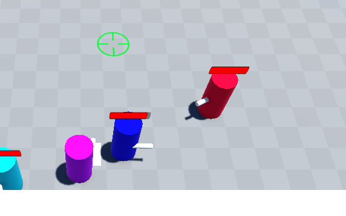
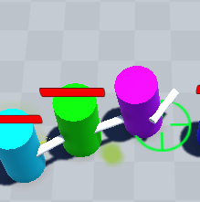
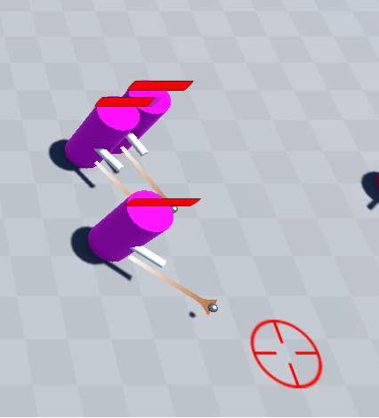

# AI Project

## Summary

- [AI Project](#ai-project)
  - [Summary](#summary)
  - [Contributors](#contributors)
  - [Presentation](#presentation)
- [Features](#features)
  - [Follow Player](#follow-player)
  - [Support Shoot](#support-shoot)
  - [Protect Player](#protect-player)
  - [Heal Player](#heal-player)
  - [Barrage Fire](#barrage-fire)
- [How to launch the project](#how-to-launch-the-project)
- [Screenshots](#screenshots)

## Contributors

- [Felix](https://github.com/fBecaud?tab=overview&from=2024-09-01&to=2024-09-30%E2%80%8B%E2%80%8B%E2%80%8B)
- [Paul](https://github.com/Susanoo1004)
  
## Presentation

This is a project we had to do in our school in our 3rd year, where we had to make a basic AI.

# Features

## Follow Player

The AI agent can follow the player if he is nearby and will walk next to him on a formation with the others agents. When the agent arrives at his position, he stops and go idle until the player start moving again.

## Support Shoot

If the player shoots then all the agents that are not healing or protecting the player will start to shoot with the player in order to support him.

## Protect Player

If the player is gonna receive a bullet, then an agent will start to move to go in front of the player to protect him from the bullets. The protector will also will also fight back by shooting a bullet in the direction of the enemy. The agent will go blue when he his in this state.

## Heal Player

If the player is critically injured and need to be healed, then an agent will start to go next to the player in order to heal him. The agent will go green when he his in this state.

## Barrage Fire

If the player decides to right click this will activate the barrage fire, where all the ally agents will stop and shoot where you right click until you click another time to deactivate it.

# How to launch the project

First dowload the project either from this repositories or from another source. Then open the project with Unity Hub with the Unity Version 2022.3.47. Once this is done open the "level" scene and then play start.

# How we did this

## Finite State Machine 

We used  a Finite State Machine (FSM) to realise our AI. We created a different state for each action the agent could do and changing his current state when he had to do an action. All the state leads to the IDLE state when they are finished. Also the BARRAGE state has priority over all the other state. 

## Limits of our FSM and possible improvements

For our IA we should had 3 differents Prefabs for a tank, an attacker and a medic where you could have changed the values for the probabilty for each event to occur. Also we didn't had the time to implement a system where their actions will be influenced by an emotinal state attached like coward, brave,... 
